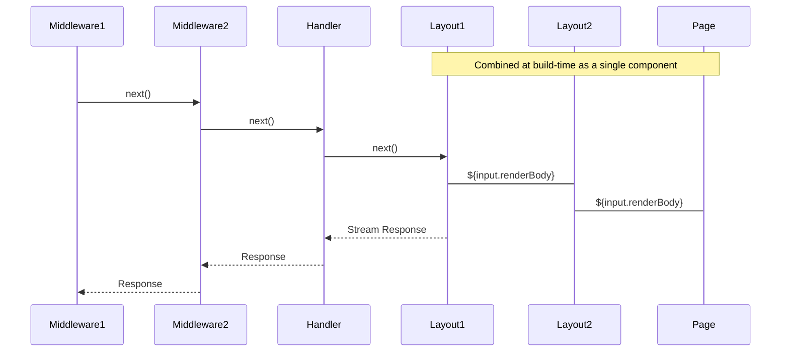

<h1 align="center">
  <!-- Logo -->
  
  <br/>
  @marko/run
	<br/>

  <!-- Language -->
  <a href="http://typescriptlang.org">
    
  </a>
</h1>

Vite plugin for Marko with these features
- Encapsulates [@marko/vite](https://github.com/marko-js/vite)
- File-based routing with layouts and middleware
- Efficient routing using a compiled static trie
- Designed with web standards to run anywhere

## Intallation

```
npm install @marko/run
```

## Vite Plugin

This package provides both a Vite plugin and a runtime import. The Vite plugin is responsible for discovering your route files, generating the routing code and registering the @marko/vite plugin which builds your .marko files.

```ts
// vite.config.ts
import { defineConfig } from "vite";
import marko from "@marko/run/vite"; // Import the Vite plugin

export default defineConfig({
  plugins: [marko()], // Register the Vite plugin
  build: {
    sourcemap: true, // Generate sourcemaps for all builds.
    emptyOutDir: false, // Avoid server & client deleting files from each other.
  }
})
```

## Runtime

Generally you'll want to use one of the adapters to provide a more convenient experience but this package provides the following runtime interface:

```ts
import { router, getMatchedRoute } from '@marko/run`;
```

### `router`
```ts
(request: Request) => Promise<Response>;
```
This asynchronouse function takes a [WHATWG request](https://fetch.spec.whatwg.org/#request-class) object and returns a [response](https://fetch.spec.whatwg.org/#response-class) object generated by executing the corresponding matched route files. If no match is found, a response with a 404 status code is returned. If an unhandled error occurs, a response with a 500 status code will be returned.

### `getMatchedRoute`
```ts
(method: string, url: URL) => {
  params: Record<string, string>;
  meta: unknown;
  invoke(request: Request): Promise<Response>;
} | null;
```
This synchronous function takes a HTTP verb method, and URL and returns an object representing the best match or null if no match is found.
- `params` - a key-value collection of any path parameters for the route
- `meta` - meta data for the route
- `invoke` - an asynchronouse function that takes a WHATWG request and returns the response generated by executing the matched route files. Note: unlike the top-level `router` function errors will not be caught.

## File-based Routing

## Nested Routing

*TODO: provide a quick overview*

### Routes Directory

By default, the plugin will look for files in the configured _routes directory_. By default it will look in `./src/routes` (relative to the Vite config file) which can be configured:

```ts
// vite.config.ts
import { defineConfig } from "vite";
import marko from "@marko/run/vite";

export default defineConfig({
  plugins: [marko({
    routesDir: 'src/pages' // Use `./src/pages` (relative to this file) as the routes directory
  })],
  //...
})
```

### Routeable Files

In order to allow for co-location of files that should not be served (e.g. tests, stories, assets), the router only recognizes a specific set of file names. The following files will be discovered in any directory within your application's _routes directory_.

#### `+page.marko`
These files establish a route at the current directory path which will be served for GET requests with the HTML content of the page. Only one page may exists for any served path.

#### `+layout.marko`
These files provide a layout component which will wrap all nested layouts and pages.

<details>
  <summary>More Info</summary>
  
  Layouts are just like any other Marko component with no extra constraints. Each layout receives the request, path params, URL and route meta data as input as well as a renderBody which will be the subsequent layout or page to project. 

  ```marko
  <div>
    <h1>My Products</h1>
    <main>
      ${input.renderBody} // project the page or layout here
    </main>
  </div>
  ```
</details>

#### `+handler.*`
These files establish a route at the current directory path which can handle requests for GET, POST, PUT and DELETE HTTP verbs. Typically these will be .js or .ts files depending on your project. Just like pages, only one handler may exist for any served path. A handler should export functions

<details>
  <summary>More Info</summary>
  
  - Valid exports are: `get`, `post`, `put`, `del`.
  - Each method takes a `context` and `next` argument and should return a WHATWG response either synchronously or asynchronously.
  - The `context` argument contains the WHATWG request object, path parameters, URL and route meta data.
  - The `next` argument will call the page for get requests where applicable or return a 204 response.

  ```ts
  export function post(context, next) {
    const { request, params, url, meta } = context;
    return new Response('updated', { status: 200 });
  }

  export function put(context, next) {
    return new Response('created', { status: 201 }); // handle the request
  }

  export function get(context, next) {
    return next(); // Call the next handler
  }

  export function del(context, next) {
    return new Response('removed', { status: 204 });
  }
  ```
</details>


#### `+middlware.*`
These files are analagous to layouts for handlers. Middlware get called before handlers and let you perform arbitrary work before and after. Unlike handlers, middleware run for all HTTP verbs.

<details>
  <summary>More Info</summary>
  
  - Expects default export that takes a `context` and `next` argument and should return a WHATWG response either synchronously or asynchronously.
  - The `context` argument contains the WHATWG request object, path parameters, URL and route meta data.
  - The `next` argument will call the next middleware, handler or page as applicable for the route.

  ```ts
  export default async function(context, next) {
    const requestName = `${ctx.request.method} ${ctx.url.href}`;
    let success = true;
    console.log(`${requestName} request started`)
    try {
      return await next(); // wait for subsequent middleware/handler/page
    } catch (err) {
      success = false;
      throw err;
    } finally {
      console.log(`${requestName} completed ${success ? 'successfully' : 'with errors'}`);
    }
  }
  ```
</details>

#### `+meta.*`
These files represent some meta data to attach to the route. This meta data will be automatically imported by the router and provided on the the route context when invoking a route. 

### Special Files

In addition to the files above which can be defined in any directory under the _routes directory_, there are some special files which can only be defined within the _routes directory_:

#### `+404.marko`
This is a special page wich will be rendered for any request whose `Accept` header includes `text/html` if no other handler or page handled the request. This page will be subject to the root layout file (ie. +layout.marko file in the _routes directory_). Responses with this page will have a `404` status code.

#### `+500.marko`
This is a special page wich will be rendered for any request whose `Accept` header includes `text/html` if an uncaught error occurs while handling the request. This page will be subject to the root layout file (ie. +layout.marko file in the _routes directory_). Responses with this page will have a `500` status code.


### Execution Order

For a matched route the routable files execute in the following order
1. Middlewares from root-most to leaf-most
2. Handler
3. Layouts from root-most to leaf-most
4. Page

<details>
  <summary>Diagram</summary>


</details>

### Path Structure

Within the _routes directory_ the directory structure will determine the path the route will be served. There are four types of directory names:

- **Static directories** - The most common type of directory. Each static directory will contribute its name as a segment in the route's served path like a traditional file server. This is the default and unless the directory matches the requirements for one of the below types, it will be a static directory.

  Examples:
  ```
  /foo
  /users
  /projects
  ```

- **Pathless directories** - These directories do not contribute their name to the route's served path. Directory names that start with an underscore ('_') as well as directories named 'index' will be a pathless directory.

  Examples:
  ```
  /_users
  /_public
  /index
  ```

- **Dynamic directories** - These directories introduce a dynamic parameter to the route's served path and will match any value at that segment. Any directory name that starts with a single dollar sign ('\$') will be a dynamic directory and the remaining directory name will be the parameter at runtime. In the case the directory name is '$', the parameter will not exist at runtime but will be matched.

  Examples:
  ```
  /$id
  /$name
  /$
  ```

- **Catcha-all directories** - These directories are similar to dynamic directories and introduce a dynamic parameter but instead of matching a single sement of the path, they match to the end of the path. Any directory that starts with two dollar signs ('\$\$') will be a catch-all directory and the remaining directory name will be the parameter at runtime. In the case of a directory name '$$', the parameter name at runtime will be '*'. Catch-all directories can be used to make not found/404 routes at any level including the root.

  Because catch-all directories always match and consume all the remaining path, you cannot have nested routes within and no further directories will be traversed.

  Examples:
  ```
  /$$all
  /$$rest
  /$$
  ```

### Match Ranking

*TODO: Write some things*
