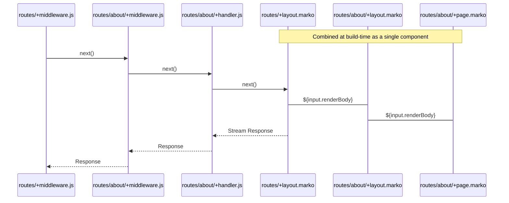

<div align="center">
  <picture>
    <source media="(prefers-color-scheme: dark)" srcset="https://github.com/marko-js/run/raw/main/assets/marko-run-darkmode.png">
    <source media="(prefers-color-scheme: light)" srcset="https://github.com/marko-js/run/raw/main/assets/marko-run.png">
    
  </picture>
  <h4>Get your app up and <em>running</em> with <a href="https://markojs.com">Marko</a>!</h4>
</div>

## Features

- 🚀 Fastest way to build a Marko app
- 💖 Scales from zero configuration
- ⚡️ Pages live-reload as you make changes
- 📁 Directory-based routes, layouts, and middleware
- 🖌️ TypeScript powered editor support
- 🧬 [Designed with web standards](https://developer.mozilla.org/en-US/docs/Web/API/URLPattern/URLPattern) to run anywhere

And when you build your production-ready app:

- 🔥 Blazing fast server-side rendering
- 🌊 Streams content to users ASAP
- 📦 Partial hydration & automatic code splitting
- 🚢 Deploy to multiple platforms

## Installation

> **Warning**
> This project is in BETA - use at your own peril, but please do provide helpful feedback.

```sh
npm install @marko/run
```

### Getting Started / Zero Config

`marko-run` makes it easy to get started without little to no config. The package ships with a default Vite config and node-based adapter.

To get started from a template:

1. `npm init marko -- -t basic`
2. `cd ./<PROJECT_NAME>`
3. `npm run dev`

Or manually create a project:

1. Install `@marko/run`
2. Create file `src/routes/+page.marko`
3. Run `npm exec marko-run`

Finally open `http://localhost:3000` 🚀

### CLI

**`dev`** - Start a development server in watch mode

```sh
> npm exec marko-run
```

or (with explicit sub command)

```sh
> npm exec marko-run dev
```

**`build`** - Create a production build

```sh
> npm exec marko-run build
```

**`preview`** - Create a production build and start the preview server

```sh
> npm exec marko-run preview
```

## File-based Routing

<!-- ### Nested Routing

*🎗 TODO: provide a quick overview* -->

### Routes Directory

The plugin looks for route files in the configured **routes directory**. By default, that’s `./src/routes`, relative to the Vite config file.

To change what directory routes are found in:

```ts
// vite.config.ts
import { defineConfig } from "vite";
import marko from "@marko/run/vite";

export default defineConfig({
  plugins: [
    marko({
      routesDir: "src/pages", // Use `./src/pages` (relative to this file) as the routes directory
    }),
  ],
});
```

### Routeable Files

The router only recognizes certain filenames which are all prefixed with `+` ([Why?](#What-about-markoserve)). The following filenames will be discovered in any directory inside your application’s [routes directory](#routes-directory).

#### `+page.marko`

These files establish a route at the current directory path which will be served for `GET` requests with the HTML content of the page. Only one page may exist for any served path.

#### `+layout.marko`

These files provide a **layout component**, which will wrap all nested layouts and pages.

Layouts are like any other Marko component, with no extra constraints. Each layout receives the request, path params, URL, and route metadata as input, as well as a `renderBody` which refers to the nested page that is being rendered.

```marko
<main>
  <h1>My Products</h1>

  <${input.renderBody}/> // render the page or layout here
</main>
```

#### `+handler.*`

These files establish a route at the current directory path which can handle requests for `GET`, `POST`, `PUT`, and `DELETE` HTTP methods. <!-- TODO: what about HEAD? -->

Typically, these will be `.js` or `.ts` files depending on your project. Like pages, only one handler may exist for any served path. A handler should export functions

<details>
  <summary>More Info</summary>
  
  - Valid exports are functions named `GET`, `POST`, `PUT`, or `DELETE`.
  - Exports can be one of the following
    - Handler function (see below)
    - Array of handler functions - will be composed by calling them in order
    - Promise that resolves to a handler function or array of handler functions 
  - Handler functions are synchronous or asynchronous functions that
    - Receives a `context` and `next` argument,
      - The `context` argument contains the WHATWG request object, path parameters, URL, and route metadata.
      - The `next` argument will call the page for `GET` requests where applicable or return a `204` response.
    - Return a WHATWG response, throw a WHATWG response, and return undefined. If the function returns undefined the `next` argument with be automatically called and used as the response.

        ```js
        export function POST(context, next) {
          const { request, params, url, meta } = context;
          return new Response('Successfully updated', { status: 200 });
        }

        export function PUT(context, next) {
          // `next` will be called for you by the runtime
        }

        export async function GET(context, next) {
          // do something before calling `next`
          const response = await next();
          // do something with the response from `next`
          return response;
        }

        export function DELETE(context, next) {
          return new Response('Successfully removed', { status: 204 });
        }
        ```

</details>

#### `+middleware.*`

These files are like layouts, but for handlers. Middleware files are called before handlers and let you perform arbitrary work before and after.

> **Note**: Unlike handlers, middleware run for all HTTP methods.

<details>
  <summary>More Info</summary>
  
  - Expects a `default` export that can be one of the following
    - Handler function (see below)
    - Array of handler functions - will be composed by calling them in order
    - Promise that resolves to a handler function or array of handler functions 
  - Handler functions are synchronous or asynchronous functions that
    - Receives a `context` and `next` argument,
      - The `context` argument contains the WHATWG request object, path parameters, URL, and route metadata.
      - The `next` argument will call the page for `GET` requests where applicable or return a `204` response.
    - Return a WHATWG response, throw a WHATWG response, and return undefined. If the function returns undefined the `next` argument with be automatically called and used as the response.

        ```ts
        export default async function(context, next) {
          const requestName = `${context.request.method} ${context.url.href}`;
          let success = true;
          console.log(`${requestName} request started`)
          try {
            return await next(); // Wait for subsequent middleware, handler, and page
          } catch (err) {
            success = false;
            throw err;
          } finally {
            console.log(`${requestName} completed ${success ? 'successfully' : 'with errors'}`);
          }
        }
        ```

</details>

#### `+meta.*`

These files represent static metadata to attach to the route. This metadata will be automatically provided on the route `context` when invoking a route.

### Special Files

In addition to the files above which can be defined in any directory under the [routes directory](#routes-directory), some special files can only be defined at its top level. <!-- TODO: do we want to keep this restriction? Having nested 404s would be handy for disambiguating things like “there’s no user with that name” or “that promotion wasn’t found, it may have expired” -->

These special pages are subject to a root layout file (`pages/+layout.marko` in the default configuration).

#### `+404.marko`

This special page responds to any request where:

- The `Accept` request header includes `text/html`
- _And_ no other handler or page rendered the request

Responses with this page will have a `404` status code.

#### `+500.marko`

This special page responds to any request where:

- The `Accept` request header includes `text/html`
- _And_ an uncaught error occurs while serving the request

Responses with this page will have a `500` status code.

### Execution Order

Given the following routes directory structure

<pre>
routes/
  about/
    +handler.js
    +layout.marko
    +middleware.js
    +page.marko
  +layout.marko
  +middleware.js
  +page.marko
</pre>

When the path `/about` is requested, the routable files execute in the following order:

1. Middlewares from root-most to leaf-most
2. Handler
3. Layouts from root-most to leaf-most
4. Page



### Path Structure

Within the [routes directory](#routes-directory), the directory structure determines the path from which the route is served. There are four types of directory names: **static**, **pathless**, **dynamic**, and **catch-all**.

1. **Static directories** - The most common type, and the default behavior. Each static directory contributes its name as a segment in the route's served path, like a traditional fileserver. Unless a directory name matches the requirements for one of the below types, it is seen as a static directory.

   Examples:

   ```
   /foo
   /users
   /projects
   ```

2. **Pathless directories** - These directories do **not** contribute their name to the route's served path. Directory names that start with an underscore (`_`) will be ignored when parsing the route.

   Examples:

   ```
   /_users
   /_public
   ```

3. **Dynamic directories** - These directories introduce a dynamic parameter to the route's served path and will match any value at that segment. Any directory name that starts with a single dollar sign (`$`) will be a dynamic directory, and the remaining directory name will be the parameter at runtime. If the directory name is exactly `$`, the parameter will not be captured but it will be matched.

   Examples:

   ```
   /$id
   /$name
   /$
   ```

4. **Catch-all directories** - These directories are similar to dynamic directories and introduce a dynamic parameter, but instead of matching a single path segment, they match to the end of the path. Any directory that starts with two dollar signs (`$$`) will be a catch-all directory, and the remaining directory name will be the parameter at runtime. In the case of a directory named `$$`, the parameter name will not be captured but it will match. Catch-all directories can be used to make `404` Not Found routes at any level, including the root.

   Because catch-all directories match any path segment and consume the rest of the path, you cannot nest route files in them and no further directories will be traversed.

   Examples:

   ```
   /$$all
   /$$rest
   /$$
   ```

### Flat Routes

Flat routes let you define paths without needing additional folders. Instead the folder structure can be defined either in the file or folder name. This allows you to decouple your routes from your folder structure or co-locate them as needed. To define a flat route, use periods (`.`) to deliniate each path segment. This behaves exacly like creating a new folder and each segment will be parsed using the rules described above for static, dynamic and pathless routes.

Flat routes syntax can be used for both directories and routable files (eg. pages, handlers, middleware, etc.). For these files, anything preceeding the plus (`+`) will be treated as the flat route.

For example to define a page at `/projects/$projectId/members` with a root layout and a project layout:

Without flat routes you would have a file structure like:

```
routes/
  projects/
    $projectId/
      $members/
        +page.marko
      +layout.marko
  +layout.marko
```

With flat routes move the path defined by the folders into the files and separate with a period

```
routes/
  +layout.marko
  projects+layout.marko
  projects.$projectId.members+page.marko
```

Additionally, you can continue to organize files under folders to decrease duplication and use flat route syntax in the folder name

```
routes/
  projects.$projectId/
    +layout.marko
    members+page.marko
  +layout.marko
```

Finally, flat routes and routes defined with directories are all treated equally and merged together. For example this page will have layout

```
routes/
  projects/
    $projectId/
      +layout.marko
  projects.$projectId+page.marko
```

### Multiple Paths, Groups and Optional Segments

Along with descibing multiple segements, flat route syntax supports defining routes that match more than one path and segments that are optional. To describe a route that matches multiple paths, use a comma (`,`) and define each route.

For example the following page matches `/projects/$projectId/members` and `/projects/$projectId/people`

```
routes/
  projects.$projectId.members,projects.$projectId.people+page.marko
```

This file name is a bit long so you might do something like this

```
routes/
  projects.$projectId
    members,people+page.marko
```

We can simplify this by introducing another concept: **grouping**. Groups allows you to define segments within a flat route that match multiple sub-paths by surrounding them with parentheses (`(` and `)`). For the example, this means you can do the following:

```
routes/
  projects.$projectId.(members,people)+page.marko
```

This is a simple example of grouping but you can nest groups and make them as complicated as you want.

The last concept is **optionallity**. By introducing an empty segment or pathless segment along with another value you can make that segment optional. For example, If we want a page that matches `/projects` and `/projects/home`, you can create a flat route that optionally matches `home`

```
routes/
  projects.(home,)+page.marko
```

or

```
routes/
  projects.(home,_pathless)+page.marko
```

While both of these create a route which matches the paths, they have slightly different semantics. Using a pathless segment is the same as creating a pathless folder which allows you to isolate middleware and loayouts. Using an empty segement is the same as defining a file at the current location.

<!-- ### Match Ranking

*TODO: Write some things* -->

## Vite Plugin

This package’s Vite plugin discovers your route files, generates the routing code, and registers the `@marko/vite` plugin to compile your `.marko` files.

```ts
// vite.config.ts
import { defineConfig } from "vite";
import marko from "@marko/run/vite"; // Import the Vite plugin

export default defineConfig({
  plugins: [marko()], // Register the Vite plugin
});
```

### Adapters

Adapters provide the means to change the development, build, and preview process to fit different deployment platforms and runtimes while allowing authors to write idiomatic code.

Specify your adapter in the Vite config when registering the `@marko/run` plugin

```ts
// vite.config.ts
import { defineConfig } from "vite";
import marko from "@marko/run/vite";
import netlify from "@marko/run-adapter-netlify"; // Import the adapter

export default defineConfig({
  plugins: [
    marko({
      adapter: netlify({ edge: true }), // Configure and apply the adapter
    }),
  ],
});
```

#### Available Adapters

- [@marko/run-adapter-node](https://github.com/marko-js/run/blob/main/packages/adapters/node/README.md)
- [@marko/run-adapter-netlify](https://github.com/marko-js/run/blob/main/packages/adapters/netlify/README.md)
- [@marko/run-adapter-static](https://github.com/marko-js/run/blob/main/packages/adapters/static/README.md)

## Runtime

Generally, when using an adapter, this runtime will be abstracted away.

<!-- TODO: Add examples -->
<!-- TODO: Split fetch and match + invoke in two sections and explain why you might use one or the other  -->

```ts
import * as Run from '@marko/run/router`;
```

### Emdedding in Existing Server

### `Run.fetch`

```ts
async function fetch<T>(request: Request, platform: T) => Promise<Response | void>;
```

This asynchronous function takes a [WHATWG `Request` object](https://fetch.spec.whatwg.org/#request-class) and an object containing any platform-specific data you may want access to, and returns any of

- a [WHATWG `Response` object](https://fetch.spec.whatwg.org/#response-class) (generated from executing any matched route files)
- `undefined` (if the request was not explicitly handled)
- a `404` status code response (if no route matches the requested path)
- a `500` status code response (if an error occurs)

Express example:

```ts
import express from "express";
import * as Run from "@marko/run/router";

express()
  .use(async (req, res, next) => {
    const request = ...; // code to create a WHATWG Request from `req`

    const response = await Run.fetch(request, {
      req,
      res
    });

    if (response) {
      // ...code to apply a response to `res`
    } else {
      next();
    }
  })
  .listen(3000);
```

### Other APIs

In some cases, you might want more control over when route matching and invocation (creating a response) occur. For instance, you may have middleware in your server which needs to know if there is a matched route. The runtime provides these additional methods:

### `Run.match`

```ts
interface Route {
  params: Record<string, string>;
  meta: unknown;
}

function match(method: string, pathname: string) => Route | null;
```

This synchronous function takes an HTTP method and path name and returns an object representing the best match, or `null` if no match is found.

- `params` - a `{ key: value }` collection of any path parameters for the route
- `meta` - metadata for the route

### `Run.invoke`

```ts
async function invoke(route: Route, request: Request, platform: any) => Promise<Response | void>;
```

This asynchronous function takes a route object returned by [Run.match](#Run.match) the request and platform data and returns a response in the same way the [Run.fetch](#Run.fetch) does.

Express example:

```ts
import express from "express";
import * as Run from "@marko/run/router";

express()
  .use((req, res) => {
    const matchedRoute = Run.match(req.method, req.path);
    if (matchedRoute) {
      req.match = matchedRoute;
    }
  })

  // ...other middleware

  .use(async (req, res, next) => {
    // Check if a route was previously matched
    if (!req.match) {
      next();
      return;
    }

    const request = ...; // code to create a WHATWG Request from `req`
    const response = await Run.invoke(req.match, request, {
      req,
      res
    });

    if (response) {
      // ...code to apply a response to `res`
    } else {
      next();
    }
  })
  .listen(3000);
```

## TypeScript

### Global Namespace

`marko/run` provides a global namespace `MarkoRun` with the following types:

**`MarkoRun.Handler`** - Type that represents a handler function to be exported by a +handler or +middleware file

**`MarkoRun.Route`** - Type of the route's params and metadata

**`MarkoRun.Context`** - Type of the request context object in a handler and `$global` in your Marko files. This type can be extended using TypeScript's module and interface merging by declaring a `Context` interface on the `@marko/run` module within your applcation code

```ts
declare module "@marko/run" {
  interface Context {
    customPropery: MyCustomThing; // will be globally defined on MarkoRun.Context
  }
}
```

**`MarkoRun.Platform`** - Type of the platform object provided by the adapter in use. This interface can be extended in that same way as `Context` (see above) by declaring a `Platform` interface:

```ts
declare module "@marko/run" {
  interface Platform {
    customPropery: MyCustomThing; // will be globally defined on MarkoRun.Platform
  }
}
```

### Generated Types

If a [TSConfig](https://www.typescriptlang.org/tsconfig) file is discovered in the project root, the Vite plugin will automatically generate a .d.ts file which provides more specific types for each of your middleware, handlers, layouts, and pages. This file will be generated at `.marko-run/routes.d.ts` whenever the project is built - including dev.

> **Note** TypeScript will not include this file by default. You should use the [Marko VSCode plugin](https://marketplace.visualstudio.com/items?itemName=Marko-JS.marko-vscode) and [add it in your tsconfig](https://www.typescriptlang.org/tsconfig#include).

These types are replaced with more specific versions per routable file:

**`MarkoRun.Handler`**

- Overrides context with specific MarkoRun.Context

**`MarkoRun.Route`**

- Adds specific parameters and meta types
- In middleware and layouts which are used in many routes, this type will be a union of all possible routes that the file will see

**`MarkoRun.Context`**

- In middleware and layouts which are used in many routes, this type will be a union of all possible routes that the file will see.
- When an adapter is used, it can provide types for the platform

## Beta Roadmap

- Error handling
- Error component
- Redirect component

## What about @marko/serve?

Once stable @marko/run will replace @marko/serve and improves upon that project in several critical ways.

1. Special "route files" (e.g. `+page.marko`) improve the developer ergonomics quite substantially. While they may cause a double take initially, making these explicit allows colocating additional components, tests, stories, config, utilities, and whatever else you need alongside the page components. With `@marko/serve` it was far too easy to "accidentally" serve some of your test fixtures :see-no-evil:.
2. @marko/serve was built around Webpack. Since Webpack doesn't have great support for SSR, a lot of this work was up to us. This was not only a maintenance burden but also lead to some rough edges such as no HMR support (just full page reloading in dev). By switching to Vite with its first-class SSR support, things all come together much more smoothly. <!-- TODO: And we're in good company (LINK TO OTHER META FRAMEWORKS ON VITE)! -->
3. @marko/serve was primarily designed with a node target in mind. @marko/run instead supports an "adapter" model, where you can author in web standard APIs and build your application to run in Node, Deno, Netlify, Cloudflare, and even a static site.
4. The programmatic API of `@marko/serve` left some to be desired which made it difficult to integrate into existing development servers and projects. Because of this, public-facing applications at eBay (the largest consumer of Marko) were not able to bring in `@marko/serve`. With `@marko/run` we've worked from the ground up to ensure a flexible enough programmatic API to allow embedding in existing complex applications. Because of this, we're confident that `@marko/run` will see much more use than `@marko/serve` and more investment from us!
5. Built-in layout management. Strictly speaking, Marko does not need the concept of `+layout.marko` "route file". If you've used Marko before you know it's very easy to treat layouts as normal components. But by bringing these layouts into the router we're able to reduce the amount of JavaScript naively sent to the browser, reduce the amount of boilerplate, and prime ourselves for some plans we have for after Marko 6 is out :eyes:.

There's more of course, but we're committed to making `@marko/run` the _best way_ to build a Marko application.
