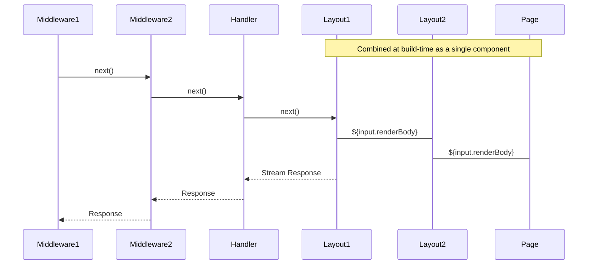

<div align="center">
  <!-- Logo -->
  <h1>
    
    <br/>
    @marko/run
  </h1>

  <!-- Language -->
  <a href="https://www.typescriptlang.org">
    
  </a>
</div>

`@marko/serve` is a Vite plugin for [Marko](https://markojs.com), with these features:

- Encapsulates [`@marko/vite`](https://github.com/marko-js/vite)
- File-based routing with layouts and middleware
- Efficient routing using a compiled static trie
- [Designed with web standards](https://developer.mozilla.org/en-US/docs/Web/API/URLPattern/URLPattern) to run anywhere

## Installation

```sh
npm install @marko/run
```

## Vite Plugin

This package’s Vite plugin discovers your route files, generates the routing code, and registers the `@marko/vite` plugin to compile your `.marko` files.

```ts
// vite.config.ts
import { defineConfig } from "vite";
import marko from "@marko/run/vite"; // Import the Vite plugin

export default defineConfig({
  plugins: [marko()], // Register the Vite plugin
  build: {
    sourcemap: true, // Generate sourcemaps for all builds
    emptyOutDir: false, // Avoid server & client deleting files from each other. TODO: do we have to make the user set this themselves?
  }
})
```

## Runtime

Generally, using one of the adapters is more convenient <!-- TODO: is an “adapter” the same thing as using the Vite plugin above? -->, but this package also provides a runtime API:

```ts
import { router, getMatchedRoute } from '@marko/run`;
```

### `router`

```ts
(request: Request) => Promise<Response>;
```

This asynchronous function takes a [WHATWG `Request` object](https://fetch.spec.whatwg.org/#request-class) and returns a [`Response` object](https://fetch.spec.whatwg.org/#response-class) generated by executing any matched route files.

If no match is found, returns a response with a `404` status code. If an unhandled error occurs, returns a response with a `500` status code.

### `getMatchedRoute`

```ts
(method: string, url: URL) => {
  params: Record<string, string>;
  meta: unknown;
  invoke(request: Request): Promise<Response>;
} | null;
```

This synchronous function takes an HTTP method + URL, then returns an object representing the best match — or `null` if no match is found.

- `params` - a `{ key: value }` collection of any path parameters for the route
- `meta` - metadata for the route
- `invoke` - an asynchronous function that takes a `Request` and returns the `Response` generated from matched route files.
  > **Note**: unlike the top-level `router` function, errors will not be caught.

## File-based Routing

### Nested Routing

*🎗 TODO: provide a quick overview*

### Routes Directory

The plugin looks for route files in the configured **routes directory**. By default, that’s `./src/routes`, relative to the Vite config file.

To change what directory routes are found in:

```ts
// vite.config.ts
import { defineConfig } from "vite";
import marko from "@marko/run/vite";

export default defineConfig({
  plugins: [marko({
    routesDir: 'src/pages' // Use `./src/pages` (relative to this file) as the routes directory
  })]
})
```

### Routeable Files

To allow for colocation of files that shouldn’t be served (like tests, assets, etc.), the router only recognizes certain filenames.

The following filenames will be discovered in any directory inside your application’s [routes directory](#routes-directory).

#### `+page.marko`

These files establish a route at the current directory path which will be served for `GET` requests with the HTML content of the page. Only one page may exists for any served path.

#### `+layout.marko`

These files provide a **layout component**, which will wrap all nested layouts and pages.

Layouts are like any other Marko component with no extra constraints. Each layout receives the request, path params, URL, and route metadata as input, as well as a `renderBody` which will be the next layout or page to project. 

```marko
<main>
  <h1>My Products</h1>

  ${input.renderBody} // render the page or layout here
</main>
```

#### `+handler.*`

These files establish a route at the current directory path which can handle requests for `GET`, `POST`, `PUT`, and `DELETE` HTTP methods. <!-- TODO: what about HEAD? -->

Typically, these will be `.js` or `.ts` files depending on your project. Like pages, only one handler may exist for any served path. A handler should export functions

<details>
  <summary>More Info</summary>
  
  - Valid exports are functions named `get`, `post`, `put`, or `del`.
  - Each export receives a `context` and `next` argument, and should return a WHATWG `Response` either synchronously or asynchronously.
    - The `context` argument contains the WHATWG request object, path parameters, URL, and route metadata.
    - The `next` argument will call the page for get requests where applicable or return a `204` response.

  ```js
  export function post(context, next) {
    const { request, params, url, meta } = context;
    return new Response('Successfully updated', { status: 200 });
  }

  export function put(context, next) {
    return new Response('Successfully created', { status: 201 }); // handle the request
  }

  export function get(context, next) {
    return next(); // Call the next handler
  }

  export function del(context, next) {
    return new Response('Successfully removed', { status: 204 });
  }
  ```
</details>


#### `+middleware.*`

These files are like layouts, but for handlers. Middleware get called before handlers and let you perform arbitrary work before and after.

> **Note**: Unlike handlers, middleware run for all HTTP methods.

<details>
  <summary>More Info</summary>
  
  Expects a `default` export that receives a `context` and `next` argument, and should return a WHATWG response either synchronously or asynchronously.
	
  - The `context` argument contains the WHATWG `Request` object, path parameters, URL, and route metadata.
  - The `next` argument will call the next middleware, handler, or page for the route.

  ```ts
  export default async function(context, next) {
    const requestName = `${ctx.request.method} ${ctx.url.href}`; // TODO: could this be just `ctx.url` with a `toString` that then grabs `.href`?
    let success = true;
    console.log(`${requestName} request started`)
    try {
      return await next(); // Wait for subsequent middleware/handler/page
    } catch (err) {
      success = false;
      throw err;
    } finally {
      console.log(`${requestName} completed ${success ? 'successfully' : 'with errors'}`);
    }
  }
  ```
</details>

#### `+meta.*`

These files represent metadata to attach to the route. This metadata will be automatically provided on the the route `context` when invoking a route. 

### Special Files

In addition to the files above which can be defined in any directory under the _routes directory_, there are some special files which can only be defined at the top-level of the _routes directory_. <!-- TODO: do we want to keep this restriction? Having nested 404s would be handy for disambiguating things like “there’s no user with that name” or “that promotion wasn’t found, it may have expired” -->

These special pages are subject to a root layout file (`pages/+layout.marko` in the default configuration).

#### `+404.marko`

This special page responds to any request where:

- The `Accept` request header includes `text/html`
- *And* no other handler or page rendered the request

Responses with this page will have a `404` status code.

#### `+500.marko`

This special page responds to any request where:

- The `Accept` request header includes `text/html`
- *And* an uncaught error occurs while serving the request

Responses with this page will have a `500` status code.

### Execution Order

For a matched route, the routable files execute in the following order:

1. Middlewares from root-most to leaf-most
2. Handler
3. Layouts from root-most to leaf-most
4. Page



### Path Structure

Within the _routes directory_, the directory structure will determine the path the route will be served. There are four types of directory names: static, pathless, dynamic, and catch-all.

1. **Static directories** - The most common type. Each static directory contributes its name as a segment in the route's served path, like a traditional fileserver. Unless a directory name matches the requirements for one of the below types, it defaults to a static directory.

  Examples:
  ```
  /foo
  /users
  /projects
  ```

2. **Pathless directories** - These directories do **not** contribute their name to the route's served path. Directory names that start with an underscore (`_`) or directories named `index` will be a pathless directory.

  Examples:
  ```
  /_users
  /_public
  /index
  ```

3. **Dynamic directories** - These directories introduce a dynamic parameter to the route's served path and will match any value at that segment. Any directory name that starts with a single dollar sign (`$`) will be a dynamic directory, and the remaining directory name will be the parameter at runtime. If the directory name is exactly `$/`, the parameter will not exist at runtime but will be matched.

  Examples:
  ```
  /$id
  /$name
  /$
  ```

4. **Catch-all directories** - These directories are similar to dynamic directories and introduce a dynamic parameter, but instead of matching a single path segment, they match to the end of the path. Any directory that starts with two dollar signs (`$$`) will be a catch-all directory, and the remaining directory name will be the parameter at runtime. In the case of a directory named `$$/`, the parameter name at runtime will be `*`. Catch-all directories can be used to make `404` Not Found routes at any level, including the root.

  Because catch-all directories match any path segment and consume the rest of the path, you cannot nest route files in them and no further directories will be traversed.

  Examples:
  ```
  /$$all
  /$$rest
  /$$
  ```

### Match Ranking

*TODO: Write some things*
